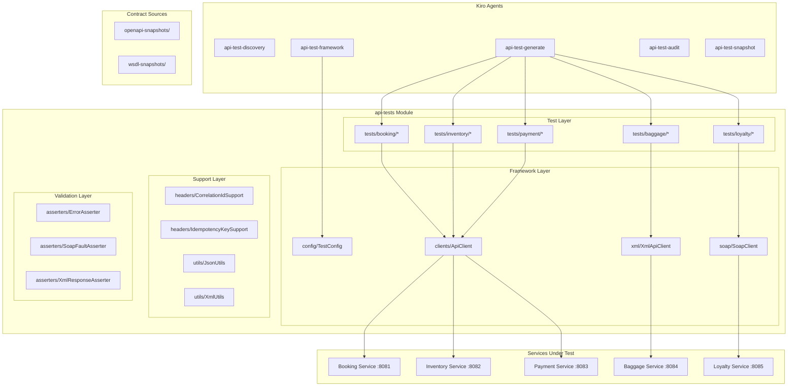

# Design Document: API Test Automation Framework

## Overview

This design document describes the architecture and implementation of an enterprise-grade API Test Automation Framework for the Flight Booking Platform. The framework provides black-box functional testing capabilities for five microservices across three API types: JSON REST, XML REST, and SOAP.

The framework follows SOLID principles with SRP-first design, ensuring each component has a single responsibility. It integrates with Kiro for AI-powered test generation and supports multiple execution modes (audit/delta/full).

## Architecture



## Components and Interfaces

### 1. Configuration Component

```java
// framework/config/TestConfig.java
public class TestConfig {
    private static TestConfig instance;
    
    private final String baseUrlBooking;
    private final String baseUrlInventory;
    private final String baseUrlPayment;
    private final String baseUrlBaggage;
    private final String baseUrlLoyalty;
    private final String env;
    private final boolean logHttp;
    
    public static TestConfig getInstance();
    public String getBaseUrl(ServiceType service);
    public boolean isLocal();
    public boolean isLogHttpEnabled();
}

public enum ServiceType {
    BOOKING, INVENTORY, PAYMENT, BAGGAGE, LOYALTY
}
```

### 2. Client Interfaces

```java
// framework/clients/ApiClient.java
public interface ApiClient {
    Response get(String path, Map<String, String> headers);
    Response post(String path, Map<String, String> headers, Object body);
    Response put(String path, Map<String, String> headers, Object body);
    Response patch(String path, Map<String, String> headers, Object body);
    Response delete(String path, Map<String, String> headers);
}

// framework/clients/RestAssuredApiClient.java
public class RestAssuredApiClient implements ApiClient {
    private final String baseUrl;
    private final boolean logHttp;
    
    public RestAssuredApiClient(String baseUrl);
    // Implements all ApiClient methods using RestAssured
}
```

### 3. XML REST Client

```java
// framework/xml/XmlApiClient.java
public class XmlApiClient implements ApiClient {
    private final String baseUrl;
    private final boolean logHttp;
    
    public XmlApiClient(String baseUrl);
    // Sets Content-Type: application/xml
    // Sets Accept: application/xml
    // Uses XmlUtils for serialization
}

// framework/xml/XmlRequestBuilder.java
public abstract class XmlRequestBuilder<T extends XmlRequestBuilder<T>> {
    protected String namespace;
    
    public T withNamespace(String namespace);
    public abstract String build();
}

// framework/xml/BaggageCheckinXmlBuilder.java
public class BaggageCheckinXmlBuilder extends XmlRequestBuilder<BaggageCheckinXmlBuilder> {
    public BaggageCheckinXmlBuilder withBookingId(String bookingId);
    public BaggageCheckinXmlBuilder withPassengerId(String passengerId);
    public BaggageCheckinXmlBuilder withBagTag(String bagTag);
    public BaggageCheckinXmlBuilder withOrigin(String origin);
    public BaggageCheckinXmlBuilder withDestination(String destination);
    public String build();
}
```

### 4. SOAP Client

```java
// framework/soap/SoapClient.java
public interface SoapClient {
    SoapResponse sendRequest(String soapAction, String envelope);
}

// framework/soap/SoapClientImpl.java
public class SoapClientImpl implements SoapClient {
    private final String baseUrl;
    private final String soapEndpoint; // e.g., "/ws"
    
    public SoapClientImpl(String baseUrl);
    public SoapResponse sendRequest(String soapAction, String envelope);
}

// framework/soap/SoapEnvelopeBuilder.java
public class SoapEnvelopeBuilder {
    private String namespace;
    private String bodyContent;
    
    public SoapEnvelopeBuilder withNamespace(String namespace);
    public SoapEnvelopeBuilder withBody(String body);
    public String build();
}

// framework/soap/SoapResponse.java
public class SoapResponse {
    private final int statusCode;
    private final String rawResponse;
    
    public boolean isFault();
    public String getBody();
    public SoapFault getFault();
}

// framework/soap/SoapFault.java
public class SoapFault {
    private final String faultCode;
    private final String faultString;
    private final String faultDetail;
    private final String loyaltyFaultCode;
    private final String loyaltyFaultMessage;
}

// framework/soap/LoyaltySoapRequestBuilder.java
public class LoyaltySoapRequestBuilder {
    public static String enrollMember(String firstName, String lastName, String email);
    public static String getMemberStatus(String memberId);
    public static String accruePoints(String memberId, String bookingId, 
                                       String amount, String currency, String correlationId);
}
```

### 5. Header Support

```java
// framework/headers/CorrelationIdSupport.java
public class CorrelationIdSupport {
    public static final String HEADER_NAME = "X-Correlation-Id";
    
    public static String generate();
    public static Map<String, String> withCorrelationId(Map<String, String> headers);
    public static Map<String, String> withCorrelationId(Map<String, String> headers, String id);
}

// framework/headers/IdempotencyKeySupport.java
public class IdempotencyKeySupport {
    public static final String HEADER_NAME = "Idempotency-Key";
    
    public static String generate();
    public static Map<String, String> withIdempotencyKey(Map<String, String> headers);
}
```

### 6. Asserters

```java
// framework/asserters/ErrorAsserter.java
public class ErrorAsserter {
    public static void assertValidErrorResponse(ErrorResponse error);
    public static void assertStatusCode(ErrorResponse error, int expectedStatus);
    public static void assertCorrelationId(ErrorResponse error, String expectedId);
    public static void assertMessageContains(ErrorResponse error, String substring);
}

// framework/asserters/SoapFaultAsserter.java
public class SoapFaultAsserter {
    public static void assertValidSoapFault(SoapFault fault);
    public static void assertFaultCode(SoapFault fault, String expectedCode);
    public static void assertFaultMessageContains(SoapFault fault, String substring);
}

// framework/asserters/XmlResponseAsserter.java
public class XmlResponseAsserter {
    public static void assertValidXmlResponse(Response response);
    public static void assertXmlElementPresent(String xml, String elementName);
    public static void assertXmlElementValue(String xml, String elementName, String expected);
}
```

### 7. Utilities

```java
// framework/utils/JsonUtils.java
public class JsonUtils {
    public static String toJson(Object obj);
    public static <T> T fromJson(String json, Class<T> type);
}

// framework/utils/XmlUtils.java
public class XmlUtils {
    public static String toXml(Object obj);
    public static String toXml(Object obj, String namespace);
    public static <T> T fromXml(String xml, Class<T> type);
    public static String wrapWithNamespace(String content, String rootElement, String namespace);
}

// framework/utils/EnvUtils.java
public class EnvUtils {
    public static String getEnv(String name, String defaultValue);
    public static String requireEnv(String name);
    public static boolean isLocal();
}
```

### 8. TestKit

```java
// framework/testkit/LocalTestClient.java
public class LocalTestClient {
    private final ApiClient client;
    
    public LocalTestClient(ApiClient client);
    public void reset();
    public void configureFailures(FailureConfig config);
    public List<Map<String, Object>> events();
}

// framework/testkit/LocalTestGuard.java
public class LocalTestGuard {
    public static void ensureLocal();
    public static boolean isLocal();
}

// framework/testkit/FailureConfig.java
public class FailureConfig {
    public static FailureConfig timeout(int ms);
    public static FailureConfig error(int statusCode);
    public static FailureConfig latency(int ms);
    public static FailureConfig disabled();
    public Map<String, Object> toMap();
}
```

## Data Models

### Request Models

```java
// framework/models/request/CreateBookingRequest.java
public record CreateBookingRequest(
    String flightId,
    String passengerId,
    String seatClass
) {}

// framework/models/request/SeedInventoryRequest.java
public record SeedInventoryRequest(
    String flightId,
    String seatClass,
    int availableSeats
) {}
```

### Response Models

```java
// framework/models/response/BookingResponse.java
public record BookingResponse(
    String bookingId,
    String flightId,
    String passengerId,
    String seatClass,
    String status,
    BigDecimal price,
    String correlationId
) {}

// framework/models/response/InventoryReservationResponse.java
public record InventoryReservationResponse(
    String bookingId,
    String reservationId,
    String status,
    String reason,
    String flightId,
    String seatClass,
    Instant createdAt
) {}

// framework/models/common/ErrorResponse.java
public record ErrorResponse(
    String timestamp,
    int status,
    String error,
    String message,
    String path,
    String correlationId
) {}
```

## Correctness Properties

*A property is a characteristic or behavior that should hold true across all valid executions of a system—essentially, a formal statement about what the system should do. Properties serve as the bridge between human-readable specifications and machine-verifiable correctness guarantees.*

### Property 1: Production Code Isolation
*For any* generated test file, scanning its imports SHALL NOT find any packages matching `*.domain.*` or `*.application.*`.
**Validates: Requirements 1.6, 18.1**

### Property 2: RestAssured Encapsulation
*For any* test class in `api-tests/src/test/java/tests/`, scanning its imports SHALL NOT find direct RestAssured imports (only framework clients allowed).
**Validates: Requirements 4.3, 4.5**

### Property 3: Environment Variable Configuration
*For any* environment variable name in {BASE_URL_BOOKING, BASE_URL_INVENTORY, BASE_URL_PAYMENT, BASE_URL_BAGGAGE, BASE_URL_LOYALTY}, setting the variable and calling TestConfig.getBaseUrl() SHALL return the set value.
**Validates: Requirements 3.1**

### Property 4: Missing Environment Fail-Fast
*For any* required environment variable that is not set and has no default, calling TestConfig.getInstance() SHALL throw an exception with a descriptive message.
**Validates: Requirements 3.4**

### Property 5: Local Environment TestKit Access
*For any* ENV value, LocalTestGuard.isLocal() SHALL return true if and only if ENV equals "local" (case-insensitive).
**Validates: Requirements 3.6, 16.2**

### Property 6: API Client URL Binding
*For any* RestAssuredApiClient instance created with baseUrl X, all HTTP requests made through that instance SHALL be sent to URLs starting with X.
**Validates: Requirements 4.2**

### Property 7: XML Content Type Headers
*For any* request made through XmlApiClient, the Content-Type header SHALL be "application/xml" and the Accept header SHALL be "application/xml".
**Validates: Requirements 5.2, 5.3**

### Property 8: SOAP Envelope Structure
*For any* SOAP envelope built with SoapEnvelopeBuilder, the resulting string SHALL contain valid SOAP envelope structure with the specified namespace and body content.
**Validates: Requirements 6.2, 6.6**

### Property 9: Correlation ID Echo
*For any* request sent with X-Correlation-Id header value V, the response (or ErrorResponse) SHALL contain the same correlation ID value V.
**Validates: Requirements 8.2, 8.4**

### Property 10: ErrorResponse Contract Completeness
*For any* ErrorResponse object, assertValidErrorResponse() SHALL verify that timestamp, status, error, message, and path fields are non-null.
**Validates: Requirements 14.1, 14.2**

### Property 11: SOAP Fault Contract Completeness
*For any* SoapFault object extracted from a fault response, assertValidSoapFault() SHALL verify that faultCode and faultMessage fields are non-null.
**Validates: Requirements 15.1, 15.2**

### Property 12: XML Namespace Preservation
*For any* XML request built with BaggageCheckinXmlBuilder with namespace N, the resulting XML string SHALL contain the namespace declaration for N.
**Validates: Requirements 5.6, 12.3**

### Property 13: Idempotency Key Uniqueness
*For any* two consecutive calls to IdempotencyKeySupport.generate(), the returned values SHALL be different.
**Validates: Requirements 9.3**

## Error Handling

### Configuration Errors
- Missing required environment variables: Throw `ConfigurationException` with variable name
- Invalid environment value: Throw `ConfigurationException` with valid options

### HTTP Errors
- Connection refused: Wrap in `ServiceUnavailableException`
- Timeout: Wrap in `RequestTimeoutException`
- 4xx/5xx responses: Return Response object, let tests handle assertions

### XML Parsing Errors
- Malformed XML: Throw `XmlParsingException` with details
- Missing required elements: Throw `XmlValidationException`

### SOAP Errors
- SOAP faults: Parse into `SoapFault` object, do not throw
- Malformed SOAP response: Throw `SoapParsingException`

### TestKit Errors
- Non-local environment: Throw `IllegalStateException` with message

## Testing Strategy

### Unit Tests
Unit tests verify specific examples and edge cases:
- TestConfig initialization with various environment configurations
- XML serialization/deserialization with sample payloads
- SOAP envelope construction with sample operations
- Error response parsing with sample JSON
- SOAP fault parsing with sample XML

### Property-Based Tests
Property tests verify universal properties across all inputs using a property-based testing library (e.g., jqwik for Java):

Each property test MUST:
- Run minimum 100 iterations
- Reference the design document property number
- Use tag format: **Feature: api-test-automation-framework, Property {number}: {property_text}**

### Integration Tests
Integration tests verify end-to-end behavior:
- Smoke tests against running services
- Happy path lifecycle tests
- Negative tests with error validation
- Correlation ID echo verification

### Test Configuration
```java
// TestNG configuration
@Test(groups = "unit")
@Test(groups = "property")
@Test(groups = "integration")
@Test(groups = "smoke")
```
